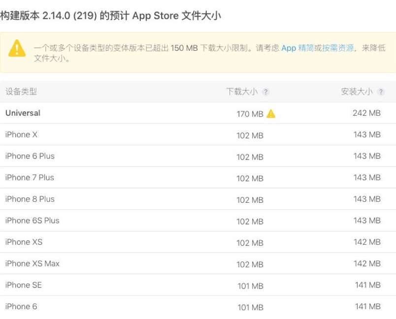
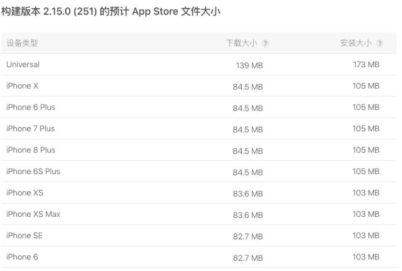
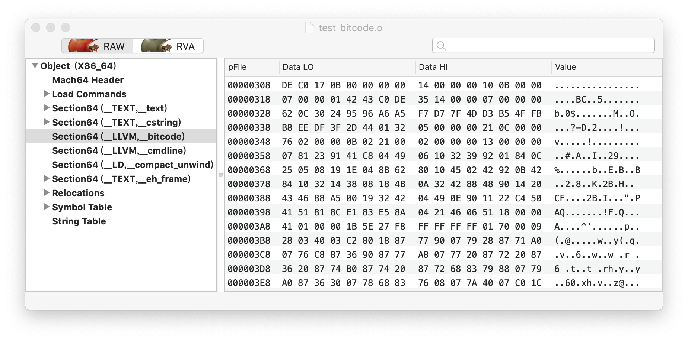
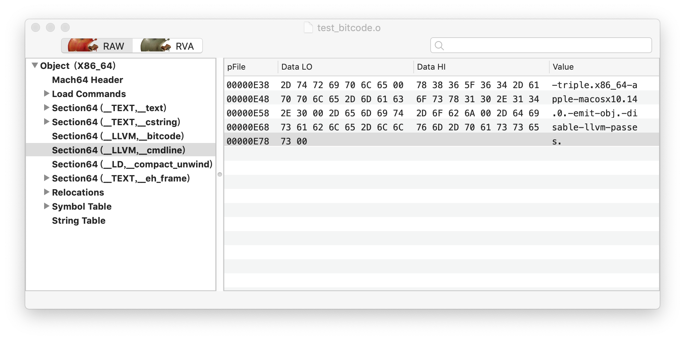

## App Thinning

### 原因：
在AppStore使用蜂窝更新下载的限制是不能超过150MB，项目大小已经接近临界值，所以需要尽量的减小包体积

### 苹果官方瘦身方法：

#### On-Demand Resources

[On-Demand Resources Essentials](https://developer.apple.com/library/archive/documentation/FileManagement/Conceptual/On_Demand_Resources_Guide/)

<!-- more -->

将图片、音频等资源文件分离出来，开发阶段将资源按照ResourceTag区分，存放在苹果的服务器上。App**按需要**发起请求，由操作系统来管理下载和存储。App拿到这些资源后释放请求。
下载的资源在多个启动周期内一直存放在设备上，访问更快。


**优点：**

* 包体积更小，设备能有更多的存储空间
* Lazy loading (Game -> level -> download current resources)
* 很少使用的资源可以放在服务器 (Tutorial)
* 请求内购资源

**缺点：**

* 惊！资源需要从苹果服务器下载！
* 资源需要按tag区分，制定相应的配置策略
* 代码中管理何时下载，何时释放等，增加资源管理的复杂度
* 不适用于项目，资源占比本来就不大

#### Slicing (iOS9之后）

Slicing本身并不需要我们做任何事情。
因为上传的包，包括二进制文件和资源文件等都具有Universal的性质，Slicing所做的就是根据设备种类切分资源。
iOS8下载的仍然是Universal包。


### IPA文件结构：

1. target
2. resources: 图片、音频、其他静态库包含的bundle
3. Frameworks(里面都是动态库，占了很大的比例，包含swift系统库和第三方库)
4. 权限和配置文件: info.plist, entitlement.plist...
5. Plugins: Widget组件等
6. 其他: 字体文件、国际化的字符串文件、CodeSignature等

```
// 按文件大小排序
brew install coreutils
du -hs * | gsort -h
```

### 资源清理：

1. 清理无用的代码，扫描后需要检查一遍

  [fus](https://github.com/tsabend/fus/blob/master/lib/fus/swift_class.rb)

2. 清理多余的图片资源

  [LSUnusedResources](https://github.com/tinymind/LSUnusedResources)

3. 图片压缩(webp格式)，视频压缩

  [WebP](https://www.jianshu.com/p/ed7562a34af1)

4. 去除重复的依赖库

  重复依赖但是没有编译问题是因为引用的是一个动态库，所以编译期间不会有问题。在App启动时加载动态库符号时，控制台会提示 `objc[111]: Class *** is implemented in both /../../.. and /../../..`，如果两份实现一样不会有问题，但如果有区别结果是不可预知的。如果直接打成静态库而不去除项目中重复的那一份，编译时就会出现报错：
`duplicated Symbol`，一个二进制中是不能有两个重复的符号的

5. 清理多余的pod

 MJExtension, Masonry, JSONModel, SwiftJSON,
 (Charts 使用缩减后的ChartsLite)

6. 编译选项优化

  一些比较通用的优化都已经用上了。试了下网上提到的一些，效果不明显，而且有些选项还需要对代码做修改，比如将Enable C++ Exceptions和Enable Objective-C Exceptions设为NO。
综上考虑不对编译选项做修改
 
 

### 将pod的打包方式改为静态库

#### 动态库和静态库

**Framework**

一个有固定结构的文件夹


 
主要构成：一个动态库或静态库 + 库所依赖的资源文件(图片、本地化字符串等) + 元数据（描述信息、版本信息等）

动态库是启动时通过dyld加载到内存的(Swift运行库是懒加载的方式)，但虽说是动态库，其作用域仅限于我们的项目以及Widget之间共享。而静态库是在build阶段就链接到主工程二进制文件里的。更详细的介绍可以看苹果官网，这里主要看下本质上有什么区别。

**Dynamic Library**

```
// bar.h

#ifndef __foo__bar__
#define __foo__bar__

#include <stdio.h>

int fizz();

#endif /* defined(__foo__bar__) */


// bar.c

#include "bar.h"
#include <CoreFoundation/CoreFoundation.h>

int fizz() {
    CFShow(CFSTR("buzz"));
    
    return 0;
}

```

* 编译obj文件

 `clang -c bar.c -o bar.o`
 
* 打成动态库

 `libtool -dynamic bar.o -o libfoo_dynamic.dylib -framework CoreFoundation -lSystem`

 ```
 // main.c
 #include "bar.h"

 int main() {
     return fizz();
 }
 ```
* 编译和链接动态库

 `clang -c main.c -o main.o`
 `ld main.o -lSystem -L. -lfoo_dynamic -o test_dynamic`

* check symbol

 ```
 $ nm test_dynamic 
 0000000000001000 A __mh_execute_header
                  U _fizz
 0000000000001fa0 T _main
                  U dyld_stub_binder
 ```
 
* check dylib 

 ```
 $ otool -L test_dynamic 
 test_dynamic:
    /usr/lib/libSystem.B.dylib (compatibility version 1.0.0, current  version 1197.1.1)
     libfoo_dynamic.dylib (compatibility version 0.0.0, current version 0.0.0)

 ```

**Static Library**

* 打成静态库

 `libtool -static bar.o -o libfoo_static.a`
 
* 链接

 `ld main.o -framework CoreFoundation -lSystem -L. -lfoo_static -o test_static`
 
* check symbol

 ```
 $ nm test_static
                  U _CFShow
                  U ___CFConstantStringClassReference
 0000000000001000 A __mh_execute_header
 0000000000001f90 T _fizz
 0000000000001f70 T _main
                  U dyld_stub_binder
 ```
 
* check lib

 ```
 $ otool -L test_static 
 test_static:
     /System/Library/Frameworks/CoreFoundation.framework/Versions/A/CoreFoundation (compatibility version 150.0.0, current version 855.17.0)
     /usr/lib/libSystem.B.dylib (compatibility version 1.0.0, current version 1197.1.1)
 ```
 
**为何打成静态库会缩小包体积？**

两个独立的二进制文件的编译优化程度一定比不上合成一个二进制文件后的优化程度。我觉得这是其原因之一。

 
**关于使用静态库或动态库哪一个更能提升启动速度的问题**
 
网上两种说法都有。分析下两种行为的本质：

假设所有第三方库都使用静态库：主二进制文件大，加载到内存的时间会稍慢（好比打开扫雷和魔兽世界）。但是dyld时间少。

假设所有第三方库都使用动态库：主二进制文件小，加载到内存相对稍快。但是dyld的时间长，主要是加载动态库和定位符号和rebase符号地址等时间。

就我们项目实际的情况来看，减少动态库，增加静态库（导致主二进制文件变大）后，pre-main的时间是缩短了大概50%。说明二进制文件变大对启动时间影响不大，但是dyld的时间确实在启动时间内占了一定的比重。

所以还需要观察项目实际运行情况，可以这样查看pre-main的时间：

Edit Scheme -> Run, Arguments -> Environment Variables
+ `DYLD_PRINT_STATISTICS 1`


#### pod动态库改为静态库的方法：

**pod转静态库的方法：**

* 如果所有pod都是纯Swift的库，只需要删除`use_frameworks!`

* 混编的工程需要在Podfile中添加 `use_modula_headers!`，并且针对OC的pod需要添加`:modular_headers => false`

* 在每个pod的podspec中添加 `s.static_framework = true`

**最终使用的方法**

偷懒的方法，用ruby脚本的方式，一次性全部将pod转为静态库

生成一个ruby脚本：

```
module Pod
    class PodTarget
        def static_framework?
        	  return true
        end
    end
end

```

然后在Podfile 中添加 `require_relative 'fileName'`，这样就能将能够将pod打成静态库了。

#### 坑：

**动态库引用到其他已被打成静态库的pod**

运行时会报错：

```
dyld: Library not loaded: @rpath/FMDB.framework
		Reference from: /../../**.framework/**SDK
		Reson: image not Found
```

有些第三方提供的SDK为封装好的动态库，而FMDB已经被打成静态库，并被链接到了主二进制文件中。运行时 dyld找不到相应符号，是因为动态库无法引用在静态库中的符号。
在无法将该第三方SDK打成静态库的情况下，只能在ruby脚本中将其依赖的库独立出来，不打成静态库

```
if pod_name != 'SDWebImage'
		...
	return true
```

**从bundle取本地资源的问题**

因为打成静态库后，第三方库的bundle就全部移动mainBundle中，而不再是mainBundle的Frameworks文件夹中了。所以如果原先是通过字符串拼接的方式从动态库中去取的话，就需要做修改，但如果是从bundleForClass的方式，是可以正常取到的

### 最终效果

安装大小相对老版本小了30多MB

* old version:

 
 
* new version:

 


#### 启动时间

之后对启动时间也做了个简单的对比（两种情况各运行了10次，取平均值）

优化前平均值为 **1.05s**

优化后平均值为 **0.48s**


### 浅谈bitcode

bitcode也是苹果在iOS9之后的AppThinning中的一项改进方案

**什么是bitcode**

* 介于源码和机器码之间，在LLVM中的IR（Intermediate Representation)这层
* 由编译器前端clang生成，交给LLVM优化器优化后交给后端生成CPU相应指令

**bitcode的作用**

将bitcode提供给Apple，由他们针对各种机型（包括新机型）的CPU对代码做二次优化，其本身不会增加包体积，上传的二进制文件会变大，但是不会影响用户的下载大小。

如果开启bitcode，相应的，所有使用的pod都需要开启bitcode，bitcode必须是完整的，否则就是无效的，编译阶段就会报错。

开启bitcode选项后，在debug模式下不会打进bitcode，只有在Archive时才会。

**简单使用bitcode**

准备一段简单的代码 test.c：

```
#include <stdio.h>

int main() {
	printf("Hello World!\n");
	return 0;
}
```

编译成obj文件`clang -c test.c -o test.o`，这个是稍后用来做对比的文件，看看使用bitcode编译出来的和这个文件有什么不同。

生成一份带bitcode的obj文件
`clang -fembed-bitcode -c test.c -o test_bitcode.o`






**抽离bitcode和cmdline:**

* 查看偏移

 `otool -l test_bitcode.o | less`
 
* 导出bitcode 

 `dd bs=1 skip=776 count=0x0000000000000b10 if=test_bitcode.o of=test_bitcode.o.bc`
 
* 导出cmdline 

 `dd bs=1 skip=3640 count=0x0000000000000042 if=test_bitcode.o of=test_bitcode.o.cmdline`
 
* check cmdline 


* 通过抽离出来的命令行编译抽离出来的bitcode文件 

 `clang -cc1 -triple x86_64-apple-macosx10.14.0 -emit-obj -disable-llvm-passes test_bitcode.o.bc -o test_rebuild.o`
 
* 校验源码编译的obj和bitcode编译出的obj


###还真是一毛一样呢！！！:P


### References

[On-Demand Resources](https://developer.apple.com/library/archive/documentation/FileManagement/Conceptual/On_Demand_Resources_Guide/)

[Static Library & Dynamic Library](https://pewpewthespells.com/blog/static_and_dynamic_libraries.html)

[Deep dive in to Swift Frameworks](https://theswiftdev.com/2018/01/25/deep-dive-into-swift-frameworks/)

[Bitcode](http://xelz.info/blog/2018/11/24/all-you-need-to-know-about-bitcode/)

[AppThinning](https://oldoldb.com/2019/01/09/App-thinning-checklist/)
